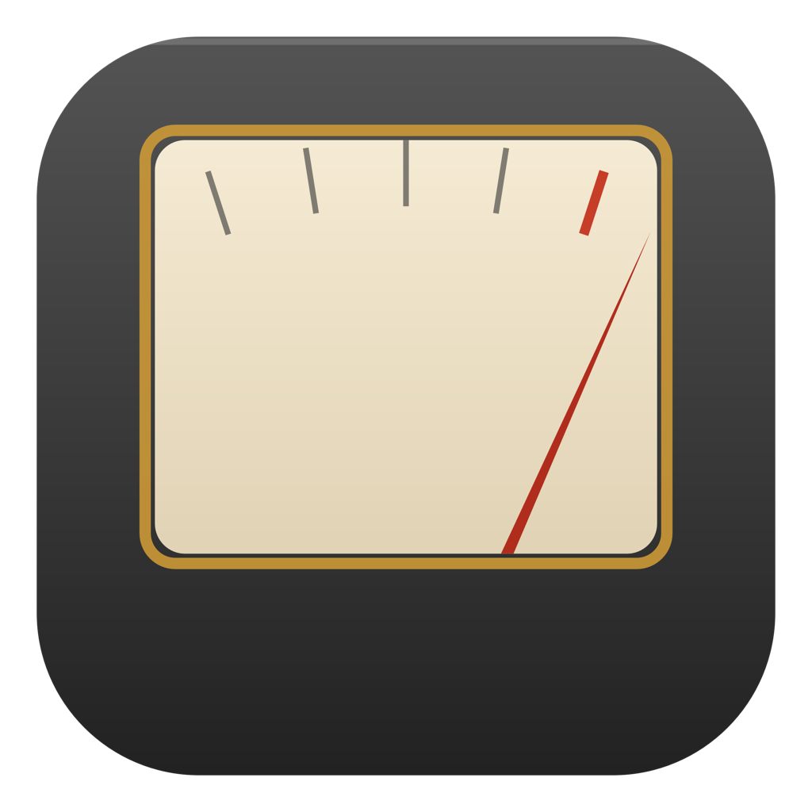
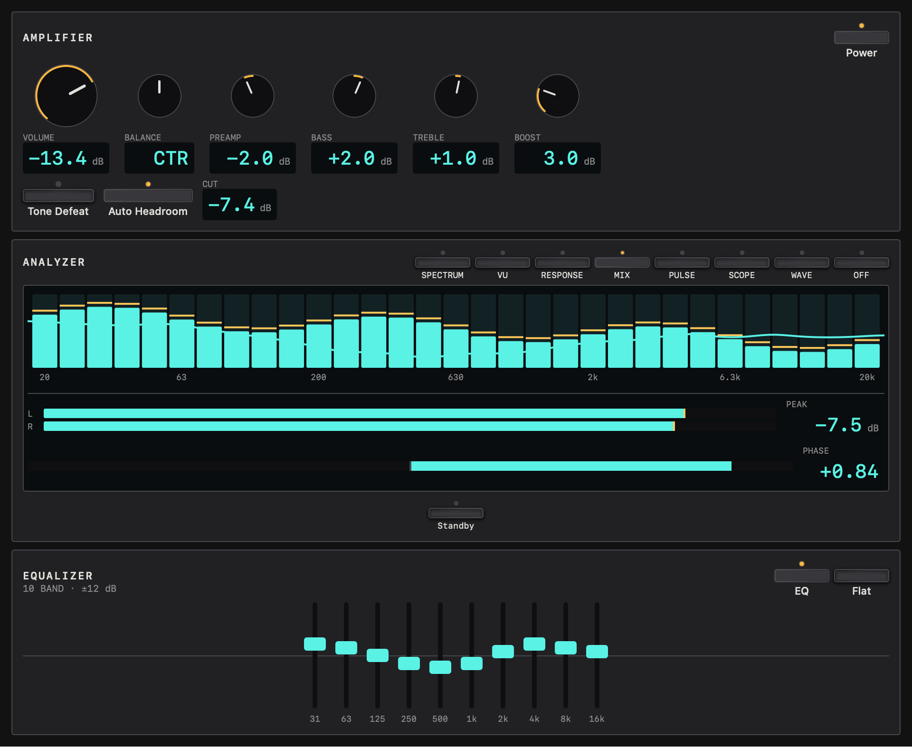
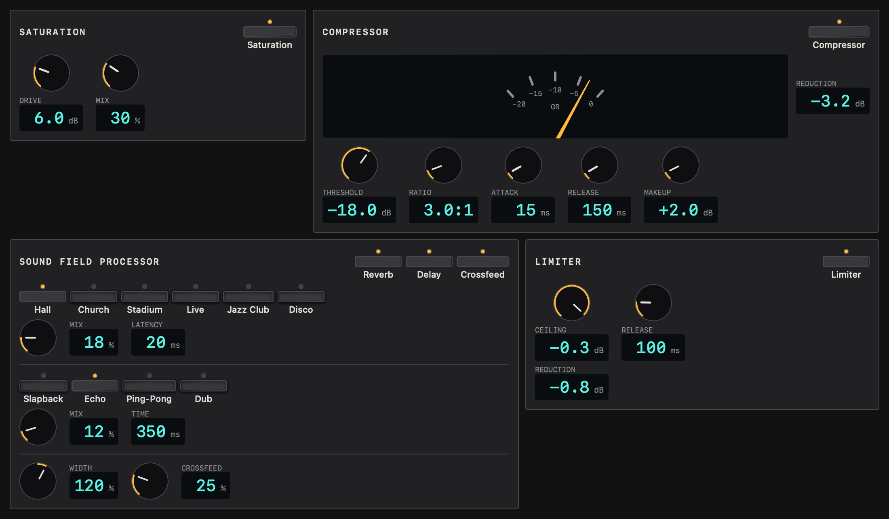
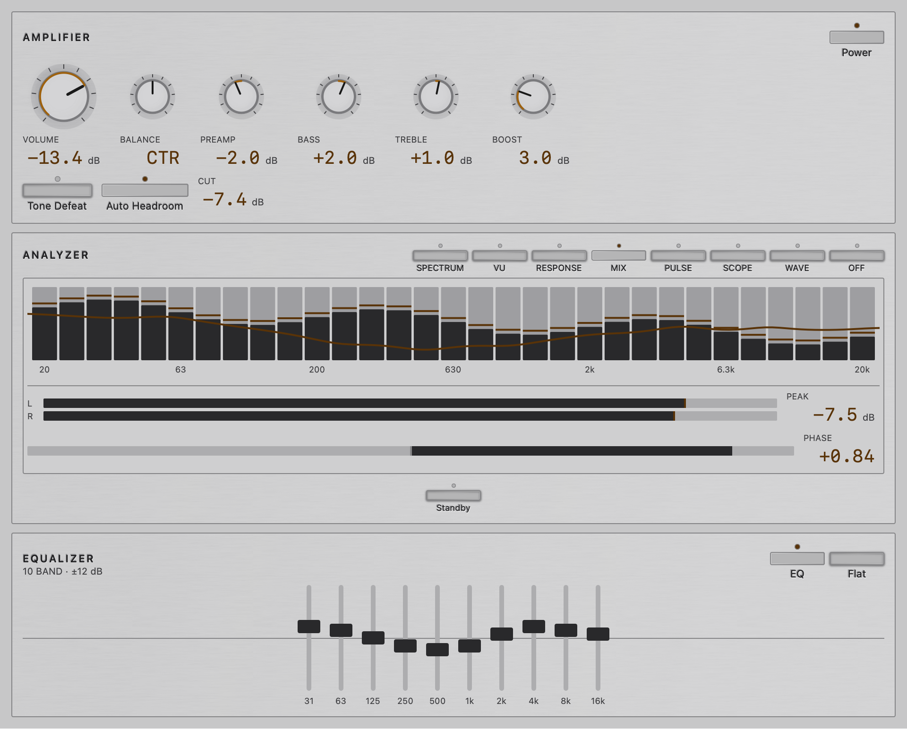
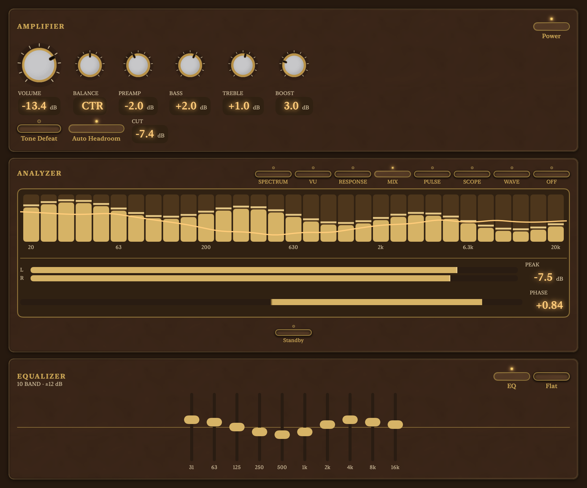

<div align="center">



# Rack

**Your Mac. Your sound.**

A system-wide audio processor with the feel of a classic hi-fi stack.
Shape everything you play—from music and movies to calls and games—in one place.

**macOS 14.4+ · Apple silicon & Intel · v0.0.1 preview**

[Get started](#get-rack) · [Features](#your-own-hi-fi-stack) · [Build from source](#build-from-source)



*Previews rendered from the current app panels with sample audio data.*

</div>

## Your own hi-fi stack

Rack sits between your apps and your output device. Tune a pair of headphones,
give small speakers a fuller sound, or bring an over-loud app into balance.
It uses macOS's Core Audio process taps; no separate virtual audio driver is needed.

| Make it sound right | Keep it under control |
| --- | --- |
| **Ten-band EQ** with bass, treble, preamp, and boost controls. | **Per-app mixing** with individual volume and mute. |
| **Tape and tube saturation** for warmth and character. | **Compressor and limiter** with gain-reduction meters. |
| **Reverb and echo** with selectable presets. | **Output selection** for your speakers, headphones, and interfaces. |
| **Stereo width and headphone crossfeed** to shape the soundstage. | **Saved presets and automatic switching** by output device or foreground app. |

See what you hear with spectrum, VU, frequency response, overlay, pulse,
goniometer, and oscilloscope displays. Reorder the rack's panels and adjust
their layout to suit your screen. Open **Settings** (⌘,) to choose which UI
components appear. Amplifier, Analyzer, Equalizer, and Sound Field Processor
are visible by default; the amplifier always stays visible. Hidden components
keep their audio settings.

Rack stays available in the menu bar when you close its window. Start or stop
the engine, bypass processing, reopen the rack, or enable launch at login
without digging through settings.



*Saturation, dynamics, and sound field controls in the Technics theme.*

## Pick your look

Thirteen themes range from dark hi-fi equipment and brushed silver to
champagne panels, studio consoles, tape machines, Bakelite, and a system
appearance. Every theme uses the same controls.

<table>
  <tr>
    <td align="center"><br><b>Silver Face</b></td>
    <td align="center"><br><b>Bakelite</b></td>
  </tr>
</table>

*The same amplifier, analyzer, and equalizer panels in two more themes.
The app also includes application mixing, input, output, and preset panels.*

## Get Rack

The first release is being prepared. When published, download
`Rack-0.0.2-macOS-universal-preview.zip` from this repository's **Releases** page.
The universal app contains both Apple silicon and Intel binaries.

1. Extract the ZIP and move **Rack.app** to **Applications**.
2. Open Rack and allow system audio capture when macOS asks.
3. Play audio, choose your output, and adjust the rack. Use **Bypass** to compare
   your settings with the original sound.

The preview is ad-hoc signed and **not notarized**. macOS Gatekeeper may block
downloaded copies. If you trust the build, use the **Open Anyway** control in
**System Settings → Privacy & Security**, following
[Apple's instructions](https://support.apple.com/en-us/102445). A Developer ID signed, notarized
build can be prepared using the [release guide](docs/RELEASING.md).

You need **macOS Sonoma 14.4 or later**. Microphone access is only needed for
optional live microphone monitoring. Use headphones for monitoring; Rack's
feedback guard holds or ducks the microphone when feedback is a concern.

### Quick controls

| Shortcut | Action |
| --- | --- |
| **⌥⌘B** | Toggle bypass |
| **⌥⌘P** | Start or stop the engine |
| **⌥⌘R** | Open the rack window |

Shortcuts work while another app is active, unless that app has already
registered the same shortcut. Closing the rack window keeps audio processing
running; choose **Quit Rack** from its menu bar menu to exit.

### Your audio stays on your Mac

Rack processes audio locally. It does not record, store, or upload your audio,
and it has no account or analytics service. Presets, app levels, and session
settings are saved in `~/Library/Application Support/Rack/`.

## Build from source

Install Apple's **Command Line Tools with Swift 6.0 or later**, then run these
commands from the downloaded or cloned source directory:

```sh
sh Scripts/build-app.sh --release --run
```

The signed app is created at `.build/app/release/Rack.app`. For a build that
runs on both Apple silicon and Intel:

```sh
sh Scripts/build-app.sh --release --universal --ad-hoc
```

Rack uses Swift Package Manager and has no third-party package dependencies.
For automated validation, run `python3 Scripts/release.py verify`.

To prepare a verified testing ZIP with logs and theme previews:

```sh
python3 Scripts/release.py test-build
```

Each build is retained separately. The [build and distribution guide](docs/BUILD_SYSTEM.md)
covers automated testing, release candidates, and publishing the exact tested app.

See the [changelog](CHANGELOG.md) for version history and release notes.

